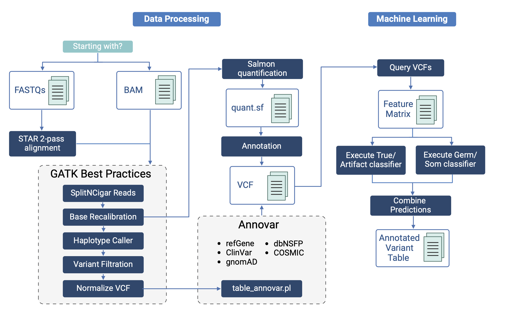

# VarRNA 


`VarRNA` is a comprehensive pipeline designed to process RNA-Seq reads from tumor samples, starting with either FASTQ or BAM files. It identifies single nucleotide variants (SNVs) and indels, and classifies these variants as germline, somatic, or artifact. Leveraging Snakemake, `VarRNA` efficiently tracks each step and processes multiple samples in parallel. The pipeline requires minimal configuration of input sample paths and manages most dependencies through a micromamba (conda) environment.The models are set up to evaluate RNA-Seq data aligned to human reference version GRCh38.




System Requirements
======

The `VarRNA` package can run on a standard computer, provided it has sufficient RAM for in-memory operations. However, for optimal performance and efficiency, especially when processing multiple samples simultaneously, we recommend using a high-performance computing environment. This setup will allow you to fully leverage the parallel processing capabilities.

Suggested RAM and CPU specs will be based on the users input file size. The runtimes below are generated using a computer with 28 GB RAM and 4 cores.


Installation
=====

## Install from Github

```
git clone https://github.com/nch-igm/VarRNA.git
cd VarRNA
```

A conda environment is used to manage *almost* all packages. Please refer to the following documentation to install micromamba (or conda), if not already installed: https://mamba.readthedocs.io/en/latest/installation/micromamba-installation.html.

Create the micromamba environment and activate it.
```
micromamba env create -f dependencies/mamba_environment.yml
micromamba activate varrna
```

## Dependencies

### ANNOVAR

ANNOVAR is used to add annotations to our VCFs using several databases. You will need to install this yourself since it requires a user agreement license. Please download annovar from their [download page](https://annovar.openbioinformatics.org/en/latest/user-guide/download/), and use the link provided from registering to download to the following directory:

```bash
wget <link/to/annovar/tar/file> -P dependencies/
tar -xvzf dependencies/annovar.latest.tar.gz -C dependencies/
```

All the databases that annovar uses will be downloaded in the ```get_resourches.sh``` script, later.

### Salmon

[Salmon](https://github.com/COMBINE-lab/salmon) read quantification is used to get TPM values. Below are the instructions to install `salmon`, create the index, and then point to it's installation location in the config file.

```bash
wget https://github.com/COMBINE-lab/salmon/releases/download/v1.9.0/salmon-1.9.0_linux_x86_64.tar.gz -P dependencies/
tar -xvzf dependencies/salmon-1.9.0_linux_x86_64.tar.gz -C dependencies/
```

Note, config/config.yaml references this installation to run salmon. If you download a different version or copy it to a different location, you will need to update that line in the ```config/config.yaml``` file (under dependencies). It is not recommended to download a different version.


## Resources

A number of resources are needed for variant calling and annotation. Download these by running:

```bash
bash get_resources.sh
```

Setup
======

## Input data

### RNA-Seq data

RNA-Seq samples can be FASTQ files or BAM files, however starting with FASTQ is suggested.

#### A. Input RNA FASTQ files (suggested)

Input FASTQ files are expected to be processed (e.g., run through fastqc, reads are trimmed).

Please use the suggested Alignment scripts first before running the pipeline to get your BAM files.

```bash
cd Alignment
# Download STAR
bash get_star.sh 
# Build the genome. The sjdbOverhang is dependent on sequencing library and should be your <max(read length) - 1>.
# You may need to edit this value in line 14 of the following script.
bash star_genome_build.sh
# Alignment using the STAR 2-pass method.
# Fastq files are in the format <sample>.R1.fastq.gz. You may need to update the script in lines 6 and 7 to match your fastq file names.
bash star_alignment.sh <sample>
```


#### B. Input RNA BAM files (not suggested but doable)

It is recommended that the RNA-Seq FASTQ files are used as input so that the reference used for alignment is consistent with variant calling and annotating. However, if you wish to use existing BAM files, please make sure you update the config file (`config/config.yaml`) with the same reference you used for alignment in the `fasta` value (line 13). If this step is not done, `VarRNA` will run into errors during annotation if contigs do not match the expected reference.


### Sample input file

You will need to modify the ```config/samples.csv``` file to add the sample names and paths to your input RNA BAM files.


## Output files
Most files generated are temporary. Saved results include annotated VCFs, and features CSV with variant labels predicted as one of Germline, Somatic, or Artifact:
```
results/<sample>/VCFs/annotated/<sample>.annotated.vcf.gz
results/<sample>/Predictions/<sample>.annotated_predictions.csv
```

Execution
======

## Running on bacth system

It is recommended to run `VarRNA` using high performance computing. The following example is using a Sun Grid Engine (SGE) batch system to allocate multiple jobs running at the same time. The `scheduler.sh` script can be altered to work with other batch system environments.

Making the `qsub_logfiles` directory will allow snakemake to create a separate logfile for each rule. This can be helpful for understanding what commands are being run, especially when your workflow becomes complex. If this step is ommited it will write all logs to one file.

The `--jobs 64` parameter provides snakemake with the maximum number of jobs it can run in parallel. You should update this value to meet your needs or limitations. Please see the [snakemake cli documentation](https://snakemake.readthedocs.io/en/stable/executing/cli.html) for a description of all parameters.

```
cd workflow
mkdir qsub_logfiles
qsub scheduler.sh
```

## Running on local computer
The snakemake pipeline can be started by running the following commands. You can change the `--cores` value to meet your needs or limitations.

```
cd workflow
snakemake --cores 2
```


